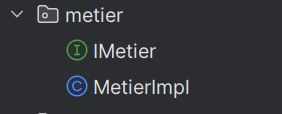

<h3>Compte rendu - Injection des Dependences</h3>
<h4>Objectif : Realiser l'injection des dependances</h4>
<h4>Activités : 
1. Créer l'interface IDao avec une méthode getDate 
2. Créer une implémentation de cette interface 
3. Créer l'interface IMetier avec une méthode calcul 
4. Créer une implémentation de cette interface en utilisant le couplage faible 
5. Faire l'injection des dépendances : 
   a. Par instanciation statique 
   b. Par instanciation dynamique 
   c. En utilisant le Framework Spring 
   - Version XML 
   - Version annotations</h4>

<h4>Modelisation :</h4>

<h6>Question 1 - 2: Creation de interface IDao et une implementation DaoImpl :</h6>

Dans le package dao, Creation de l'interface IDao avec une methode getData() et creation d'une implementation de l'interface IDao "DaoImpl" qui implemente la methode getData() qui retourne un réel aleatoire de 0 à 40.

Creation d'une extension "package ext" qui contient une autre implementation de l'interface IDao "DaoImplV2" qui implemente la methode getData() qui retourne un réel aleatoire de 0 à 60.

<h6>Question 3 - 4: Creation de interface IMetier et une implementation MetierImpl :</h6>

Dans le package metier, Creation de l'interface IMetier avec une methode calcul() et creation d'une implementation de l'interface IMetier "MetierImpl" qui implemente la methode calcul().

<h6>Question 5 - a: Injection des dependences - Instanciation statique - Resultat :</h6>

<h6>Question 5 - b: Injection des dependences - Instanciation dynamique - Resultat :</h6>

<h6>Question 5 - c: Injection des dependences - Spring Framework XML - Resultat :</h6>

<h6>Question 5 - c: Injection des dependences - Spring Framework Annotations - Resultat :</h6>
