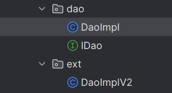
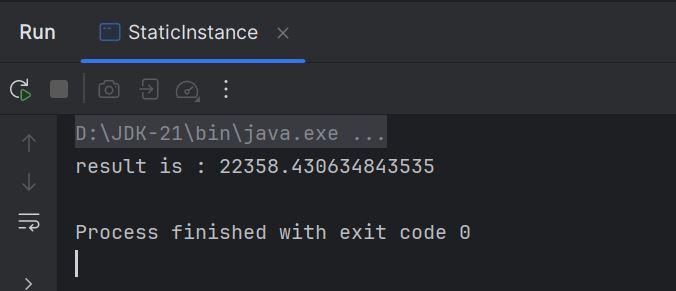

<h3>Compte rendu - Injection des Dependences</h3>
<h6>Question 1 - 2: Creation de interface IDao et une implementation DaoImpl :</h6>

<h6>Question 3 - 4: Creation de interface IMetier et une implementation MetierImpl :</h6>

<h6>Question 5 - a: Injection des dependences - Instanciation statique - Resultat :</h6>

<h6>Question 5 - b: Injection des dependences - Instanciation dynamique - Resultat :</h6>

<h6>Question 5 - c: Injection des dependences - Spring Framework XML - Resultat :</h6>

<h6>Question 5 - c: Injection des dependences - Spring Framework Annotations - Resultat :</h6>
